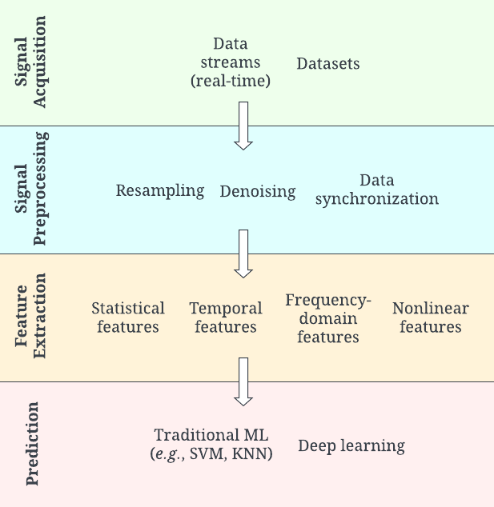
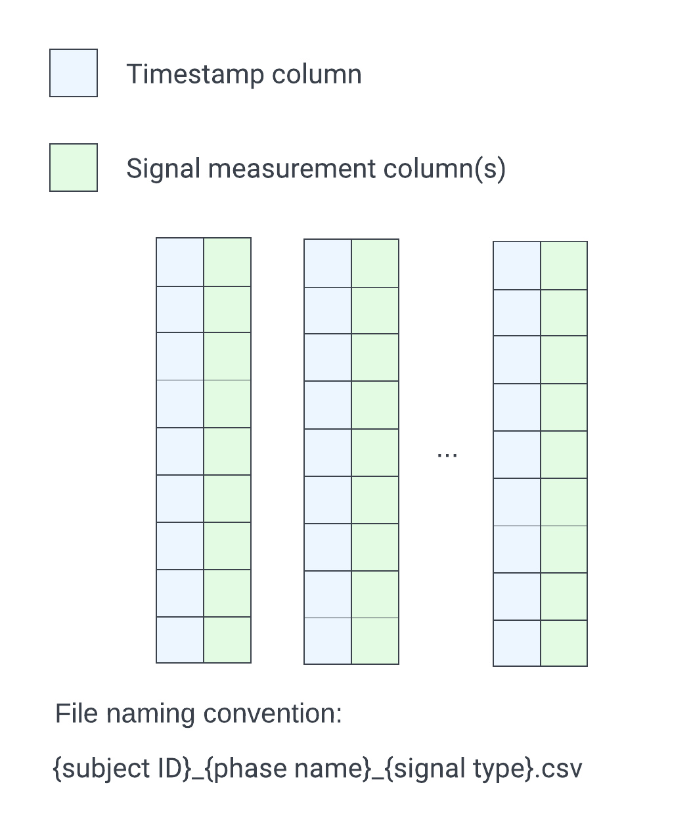

<a id="readme-top"></a>

<!-- PROJECT LOGO -->
<br />
<div align="center">
  <!-- <a href="https://github.com/othneildrew/Best-README-Template">
    
  </a> -->

  <h3 align="center">AffectEval</h3>

  <p align="center">
    A Python-based framework to jumpstart your affective computing applications!
    <!-- <br />
    <a href="https://github.com/othneildrew/Best-README-Template"><strong>Explore the docs »</strong></a>
    <br /> -->
    <!-- <br />
    <a href="https://github.com/othneildrew/Best-README-Template">View Demo</a>
    &middot;
    <a href="https://github.com/othneildrew/Best-README-Template/issues/new?labels=bug&template=bug-report---.md">Report Bug</a>
    &middot;
    <a href="https://github.com/othneildrew/Best-README-Template/issues/new?labels=enhancement&template=feature-request---.md">Request Feature</a> -->
  </p>
</div>


<!-- TABLE OF CONTENTS -->
<details>
  <summary>Table of Contents</summary>
  <ol>
    <li>
      <a href="#about-the-project">About The Project</a>
    </li>
    <li>
      <a href="#getting-started">Getting Started</a>
      <ul>
        <li><a href="#installation">Installation</a></li>
        <li><a href="#prerequisites">Prerequisites</a></li>
      </ul>
    </li>
    <li><a href="#usage">Usage</a></li>
      <ul>
        <li><a href="#installation">Formatting your data to be compatible with AffectEval</a></li>
        <li><a href="#prerequisites">Examples</a></li>
      </ul>
    <li><a href="#roadmap">Citing</a></li>
    <li><a href="#contributing">Contributing</a></li>
    <!-- <li><a href="#license">License</a></li> -->
    <li><a href="#contact">Contact</a></li>
    <li><a href="#acknowledgments">Acknowledgments</a></li>
  </ol>
</details>


<!-- ABOUT THE PROJECT -->
## About The Project
AffectEval is a modular and customizable affective computing framework, aimed to facilitate the development of end-to-end affective computing pipelines from raw signals to model training and evaluation. It is Python-based and designed in an object-oriented paradigm, with separate classes for each component in the affective computing pipeline (see Fig. 1).

AffectEval is designed with mental healthcare-focused affective computing applications in mind, and primarily supports time-series data at the moment. We plan to expand our scope to include other types of signals as well, such as text, video, and audio (see the [documentation](https://docs.google.com/document/d/11Ep4rF1QWcYwDGs62m5ssoAy_pgyZjqRRKB3uavTTqc/edit?tab=t.0#heading=h.22wedm27kxfq) for more details on what signals we currently support, and what methods are pre-implemented).

This repository is also a platform for community contributions. Please open pull requests to add methods and models you find useful so that others can use them as well! See <a href="#contributing">Contributing</a> for more details.

<div align="center">
    <figure>
        
        <h4>The affective computing pipeline, originally described in [1].</h4>
    </figure>
</div> 

<p align="right">(<a href="#readme-top">back to top</a>)</p>


<!-- GETTING STARTED -->
## Getting Started

### Prerequisites
- [BioSPPy](https://biosppy.readthedocs.io/en/stable/)
- [NeuroKit2](https://neuropsychology.github.io/NeuroKit/)
- [HeartPy](https://python-heart-rate-analysis-toolkit.readthedocs.io/en/latest/)

### Installation
Install AffectEval by cloning the repository:
```
git clone https://github.com/ANRGUSC/AffectEval.git
```

<p align="right">(<a href="#readme-top">back to top</a>)</p>


<!-- USAGE -->
## Usage
AffectEval was designed to reduce the amount of manual work required to implement affective computing pipelines. It is composed of Python classes that represent individual blocks, which can be modified and switched out independently if needed.

### Formatting your data to be compatible with AffectEval
 In order to take the workload off the user and enable automatic message-passing between components, we impose requirements on the format of input data:

 <div align="center">
    <figure>
        
    </figure>
</div> 

Specifically, files should be in the Comma Separated Value file format (.csv), named with the subject ID, name of the experimental phase (e.g., Baseline, Stress, Recovery, etc.), and the signal type (e.g., ECG, EDA, EMG, etc.). Refer to the [documentation](https://docs.google.com/document/d/11Ep4rF1QWcYwDGs62m5ssoAy_pgyZjqRRKB3uavTTqc/edit?tab=t.0#heading=h.22wedm27kxfq) to see the exact abbreviations for each signal type. 

### Examples
Example scripts and Jupyter Notebook files can be found in the [examples](https://github.com/ANRGUSC/AffectEval/tree/main/examples) directory. Specifically, we created end-to-end pipelines using AffectEval for the following:

- Binary stress detection using the Wearable Stress and Affect Detection (WESAD) dataset [2] ([link](https://github.com/ANRGUSC/AffectEval/blob/main/examples/wesad_pipeline.ipynb))
- Binary stress detection using the Anxiety Phases Dataset (APD) [3] ([link](https://github.com/ANRGUSC/AffectEval/blob/main/examples/apd_pipeline.ipynb))
- Replication of binary stress detection experiments in Zhou et al. [4] ([link](https://github.com/ANRGUSC/AffectEval/blob/main/examples/zhou.ipynb))
- Replication of binary and three-class stress classification [2] ([link](https://github.com/ANRGUSC/AffectEval/blob/main/examples/schmidt.ipynb))

You will need to download the APD and/or WESAD datasets to run the corresponding scripts. WESAD is publicly available, while APD is available upon request.


<p align="right">(<a href="#readme-top">back to top</a>)</p>


<!-- Contributing -->
## Contributing
We greatly welcome community contributions to AffectEval! If you would like to contribute custom subclasses and methods for your specific affective computing application, check out a new branch:
```
git checkout -b <your-new-branch-name>
```

<p align="right">(<a href="#readme-top">back to top</a>)</p>


<!-- CONTACT -->
## Contact
Emily Zhou - emilyzho@usc.edu

<p align="right">(<a href="#readme-top">back to top</a>)</p>


<!-- CITING -->
## Citing
Please use the following to cite AffectEval:

E. Zhou, K. Khatri, Y. Zhao, and B. Krishnamachari, "AffectEval: A Modular and Customizable Framework for Affective Computing," 2025, arXiv:2504.21184.

```latex
@article{affecteval,
    title = {AffectEval: A Modular and Customizable Framework for Affective Computing},
    author = {Emily Zhou and Khushboo Khatri and Yixue Zhao and Bhaskar Krishnamachari},
    year={2025},
    eprint={2504.21184},
    archivePrefix={arXiv},
    primaryClass={cs.AI},
    url={https://arxiv.org/abs/2504.21184}
}
```

<p align="right">(<a href="#readme-top">back to top</a>)</p>


<!-- REFERENCES -->
## References
[1] J. Oliveira, S. M. Alarcão, T. Chambel, and M. J. Fonseca, "MetaFERA: A meta-framework for creating emotion recognition frameworks for physiological signals", Multimedia Tools and Applications 83, 4 (Jun 2023),
9785–9815, doi: 10.1007/s11042-023-15249-5.

[2] P. Schmidt, A. Reiss, R. Duerichen, C. Marberger, and K. Van Laerhoven, "Introducing WESAD, a Multimodal Dataset for Wearable Stress and Affect Detection", In Proceedings of the 20th ACM International Conference on Multimodal Interaction (ICMI '18). Association for Computing Machinery, New York, NY, USA, 400–408, doi: 10.1145/3242969.3242985.

[3] H. Senaratne, L. Kuhlmann, K. Ellis, G. Melvin, and S. Oviatt, "A Multimodal Dataset and Evaluation for Feature Estimators of Temporal Phases of Anxiety"," Association for Computing Machinery, New York, NY, USA, doi: 10.1145/3462244.3479900.

[4] E. Zhou, M. Soleymani and M. J. Matarić, "Investigating the Generalizability of Physiological Characteristics of Anxiety", 2023 IEEE International Conference on Bioinformatics and Biomedicine (BIBM), Istanbul, Turkiye, 2023, pp. 4848-4855, doi: 10.1109/BIBM58861.2023.10385292.

<p align="right">(<a href="#readme-top">back to top</a>)</p>